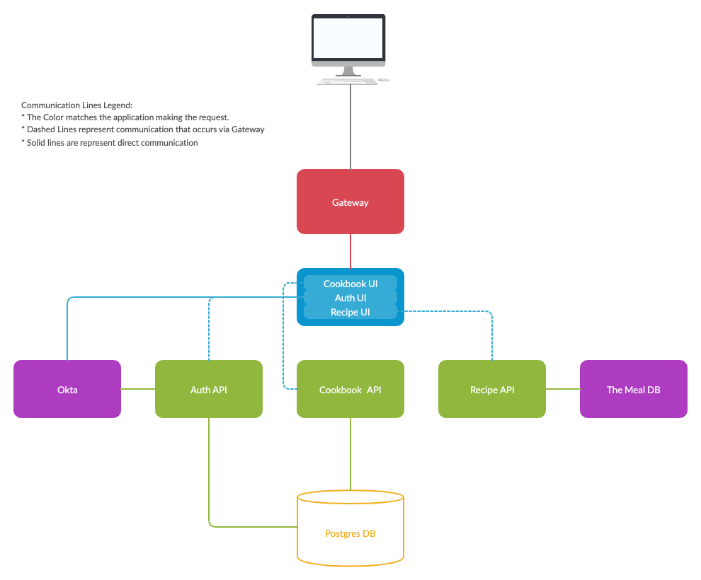
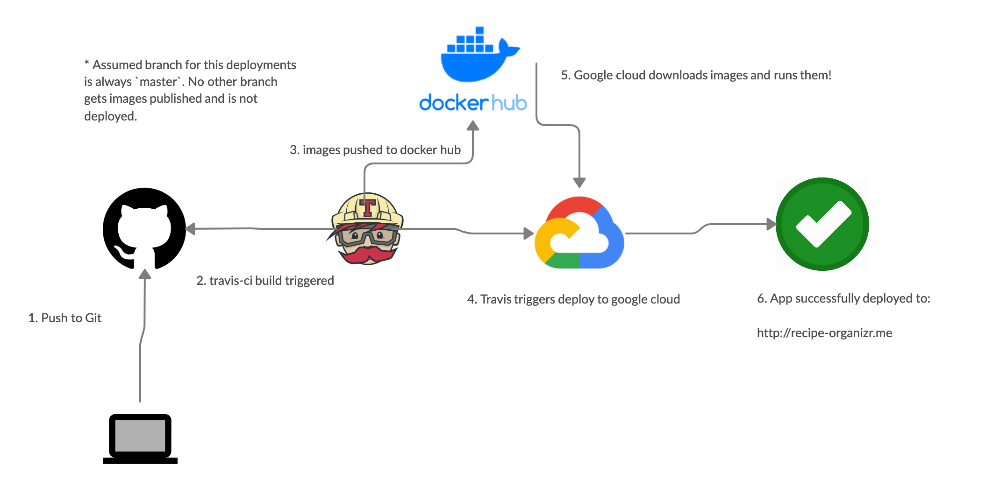

# recipe-organizr
>A web-based cookbook application built as my practicum project for my masters in software engineering.

## Build Status
> This project uses Travis CI for CI/CD builds both on commit and when a pull request is opened.

[](https://travis-ci.org/Bwvolleyball/recipe-organizr)

## Additional Content
> A large portion of the required documentation for this practicum lives in the [docs](./docs) folder.

###### Important Class Documents
* [Project Proposal](./docs/PROJECT_PROPOSAL.md)
* [Annotated Bibliography](./docs/Annotated_Bibliography.pdf)
* [Experimental Annotated Bibliograpy in Markdown](./docs/ANNOTATED_BIBLIOGRAPHY.md)
* [Field Notebook](./docs/FIELD_NOTEBOOK.md)
* [Server Install](./docs/SERVER_INSTALL.md)

## Application Architecture
> For a more comprehensive documen about this application's archietecture, view the [Project Proposal](./docs/PROJECT_PROPOSAL.md).

The Gateway is an API gateway, Spring Boot project that handles routing and load balancing.

The View layer is an Angular App with 3 distinct components, auth, recipe, and cookbook.

The API layer is comprised of Spring Boot applications for auth, recipes, and cookbooks.

The Data layer is a Postgres database, which each API that requires it has it's own database within.

This is the architecture diagram for this project:



## Running Locally
> This project is a host of microservices.  Therefore, to run this locally, there are several projects that need to be run.

**Important** The Gateway uses both HTTPS & HTTP, but to avoid a multitude of stack-traces when running this locally due 
to an invalid / unknown certificate, please follow the instructions provided in 
[this document specific to the gateway project](./gateway/TRUSTED_LOCAL_SSL.md).

You have two options for running this project locally.
1. Launch everything via Docker. (Ideal for running the app)
2. Launch each service individually. (Idea for localhost development)

No matter which option you choose, after starting the app, it'll be accessible at http://localhost:8080

### Launching Via Docker

**Prerequisites** - Docker must be installed on your machine.

This way leverages the [Docker Compose Yaml](./docker-compose.yml) in the root of the project directory.

From the project root, simply run:

```bash
docker-compose pull && docker-compose up
```

### Launching All Apps Indivudually

#### Spring Boot Microservices
> The microservices are written with Spring Boot, and so they bring along an embedded Tomcat or Netty server to run on.

**Prerequisites** - Java must be installed on your machine.

The following spring boot microservices must be run:

1. [Gateway](./gateway) - this is an API gateway and Reactive/Netty router. - Port 8080
2. [Auth API](./auth-api) - this is an authorization api that tracks users who have logged in.  
It will eventually provide authorization for actions that require it. - Port 8181
3. [Recipe API](./recipe-api) - this is a microservice that integrates with a 3rd party recipes api 
and handles some translation before service recipes to the front end. - Port 8282
4. [Cookbook API](./cookbook-api) - this is a microservice that allows users to save and view their own cookbook - 
essentially just a collection of recipes.  It currently creates a cookbook with a list of recipe ids, associated to 
a specific user. - Port 8383

From the directory of each of these projects, you can run the following command to launch them:

```bash
./gradlew bootRun
```

#### Angular Application
> The UI is written as an angular app, so running it locally relies on the angular cli.

**Prerequisites** - The Angular CLI must be installed on your machine.

the [Recipe Oragnizr UI](./recipe-organizr-ui) is an angular application, and can be run locally with the following command:

```bash
ng serve --disable-host-check
```

`--disable-host-check` is required because the angular cli runs the app on port 4200, but it must be served through the gateway on port 8080.

#### Database

You will also need Postgres running.  See the [Postgres Instructions](#Postgres-SQL) below.

## Postgres SQL

Postgres SQL is used locally for development via a docker container.  The root [docker-compose.yml](docker-compose.yml) is responsible for declaring all necessary localhost development dependencies.

To launch Posgres locally, ensure you have docker installed for your OS, then from this directory, simply run:
```bash
docker-compose up postgres

# or launch it in the background

docker-compose up -d postgres
```

If you need a mechanism to view the data, there is a pgadmin container included with the project which can serve as a viewer of the database.
Use the following command to launch it.
```bash
docker-compse up pgadmin
```
To log in, the user name is: `user@email.com` and the password is `password`.

## Swagger API Docs
> This section requires running the app to be running.  See [Running Locally](#running-locally) for additional details.
Note, this is a supporting feature of the application, but is not the application itself! Swagger is an api documentation
tool that provides for machine (and human) readable specifications of your application.  For more information, [see their
official website](https://swagger.io/)!

With the full application stack running locally, you are able to visit http://swagger.127.0.0.1.xip.io:8080
to view API documentation for the various APIs.

Select a spec (AKA, toggle between the different API applications) in the top right of the page, and then
open up either a controller to see the various API calls that are available, or the models to see the objects
that are sent back and forth between the APIs and the UI.

A static reference to the models produced by this application can be found in the [Swagger Model document](./docs/SWAGGER_MODELS.md).

## Deployment

This project is deployed via travis-ci directly to the google cloud compute engine!

It is deployed on each push (and successful build) of the `master` branch. See the below diagram for a break-down
of the CI/CD flow for this project.

This application will be hosted at http://recipe-organizr.me until this practicum has been completed.


