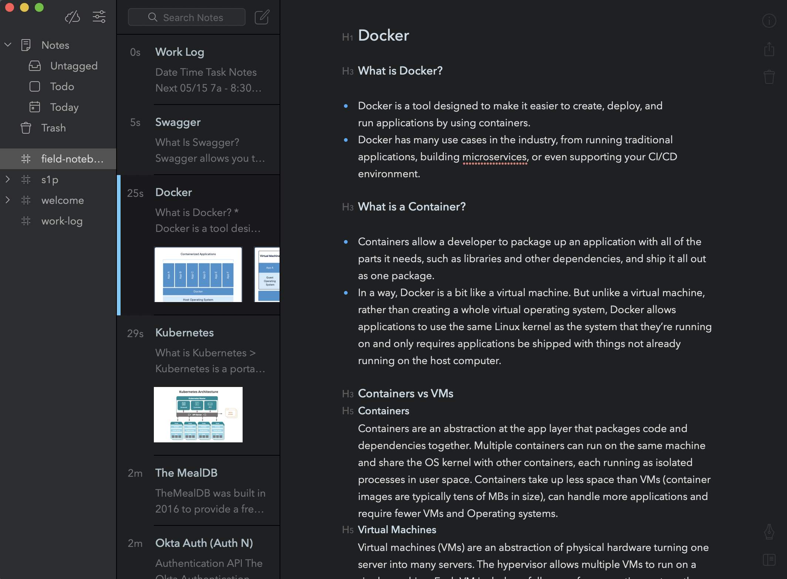

# Field Notebook
> As a requirement of this class, we needed to maintain a field notebook that had notes on things relevant to our project.

For my field notebook, I elected to use an application called [Bear](https://bear.app/).  Bear allows  taking notes
via markdown syntax, and allows organizing and arranging notes with hashtags (#).  It's a quick and fluid note-taking app
that has served me well for my practicum, and as a plus, the notes are searchable and very organizable!

###### Field Notebook Screenshot

