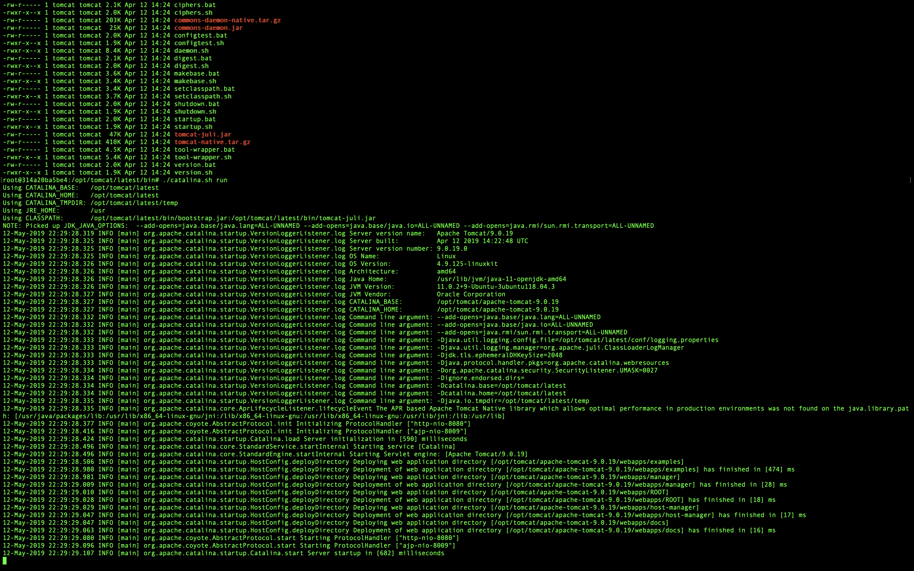
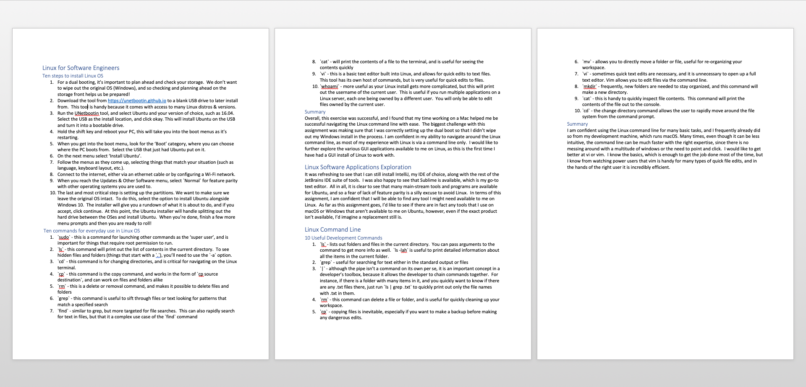

# Server Installation

As part of this course's requirements, we had to prepare a web server installation.
Various parts of my application will be deployed to different types of web servers.
The 3 types of web servers I will need are Apache, Tomcat, and Express.
The bulk of the applications will be running on Tomcat, since there will assumedly be multiple microservices, I chose to focus on the tomcat installation.

Here is the screenshot of the installed and running Tomcat server:



## Installation Steps

Here are the steps I took to install Tomcat on my Ubuntu Linux server:

1. Install Java
```bash
sudo apt update && sudo apt install openjdk-8-jdk
```

I chose OpenJDK 8, but any variant and flavor will work.

2. Created the Tomcat User
```bash
sudo useradd -r -m -U -d /opt/tomcat -s /bin/false tomcat
```

Doing this ensures that tomcat is not run as the root user, which presents a security vulnerability.

3. Install Tomcat

```bash
# download the tomcat tarball
wget http://www-eu.apache.org/dist/tomcat/tomcat-9/v9.0.20/bin/apache-tomcat-9.0.20.tar.gz -P /tmp
# un-tar it and move it to /opt/tomcat
sudo tar xf /tmp/apache-tomcat-9*.tar.gz -C /opt/tomcat
# make a symbolic link so that upgrading tomcat is a bit simpler
sudo ln -s /opt/tomcat/apache-tomcat-9.0.20 /opt/tomcat/latest
# Make sure the tomcat user has permission of the tomcat folder and that the scripts within are executable.
sudo chown -RH tomcat: /opt/tomcat/latest
sudo sh -c 'chmod +x /opt/tomcat/latest/bin/*.sh'
```

4. Configure Tomcat to be runnable as a service

```bash
sudo vi /etc/systemd/system/tomcat.service
```

Here is the contents of the `tomcat.service` file:

```properties
[Unit]
Description=Tomcat 9 servlet container
After=network.target

[Service]
Type=forking

User=tomcat
Group=tomcat

Environment="JAVA_HOME=/usr/lib/jvm/default-java"
Environment="JAVA_OPTS=-Djava.security.egd=file:///dev/urandom -Djava.awt.headless=true"

Environment="CATALINA_BASE=/opt/tomcat/latest"
Environment="CATALINA_HOME=/opt/tomcat/latest"
Environment="CATALINA_PID=/opt/tomcat/latest/temp/tomcat.pid"
Environment="CATALINA_OPTS=-Xms512M -Xmx1024M -server -XX:+UseParallelGC"

ExecStart=/opt/tomcat/latest/bin/startup.sh
ExecStop=/opt/tomcat/latest/bin/shutdown.sh

[Install]
WantedBy=multi-user.target
```

5. Turn on the Tomcat Service

```bash
sudo systemctl daemon-reload
sudo systemctl start tomcat
# Enable Tomcat to start on server boot
sudo systemctl enable tomcat
```

OPTIONAL

You can also launch Tomcat directly from the installation directory by running the `catalina.sh` script.

```bash
cd /opt/tomcat/latest/bin
# This will start Tomcat, and can receive startup parameters as well.
./catalina.sh
```

Tomcat should now be running on http://localhost:8080!

### Field Notebook Screenshot

I am still deciding on the format that will work best for me for my field notebook, however, the field notebook entries for this assignment was made in Word.
Below is the screenshot of the notes taken as part of this exercise.


