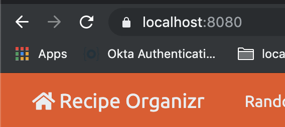

# Trusted Local SSL Certificates
> If for some reason you do not wish to run this application via HTTPS, the app still launches
> an HTTP port at 8079 - I don't recommend this, but alas, it's your local development environment.
> If you're wondering why I even bothered providing HTTP still, don't worry, it wasn't for your benefit ;)
> HTTP is still available in order to configure automatic SSL rotation for 
>[LetsEncrypt](https://letsencrypt.org/) and [Certbot](https://certbot.eff.org/).

## mkcert

A locally trusted certificate must first be generated via a tool called [mkcert](https://github.com/FiloSottile/mkcert).
Because of the security implications of mkcert, and the fact that it generates a root certificate capable of intercepting
any secure request from your machine, you *_should not_* share this certificate, and do not check it into the repo, ever!

IF you do not have a valid certificate provided by mkcert, you will default to using the included certificate generated by 
this project, but you will see `certificate_unknown` errors from the Gateway. It should not prohibit it from functioning, 
but you have been warned!

While you should rely on the tutorial and instruction on mkcert's readme if you get stuck, here's the commands 
required to generate a certificate:

1. You must generate a local CA 
2. You must create a .p12 file (you can change the path to wherever you prefer)
3. You will need to get the certificate alias, or else Spring Boot will not know what certificate you want to use.
```bash
# Create the local CA
mkcert -install # This will prompt you for your sudo password
# generate and install a valid local certificate
 mkcert -pkcs12 -p12-file ~/.ssl/recipe-organizr.p12  localhost 127.0.0.1 ::1

# List out the certificate details, and get the alias.
keytool -list -v -keystore ~/.ssl/recipe-organizr.p12 -storetype PKCS12 -storepass changeit | grep Alias
```

After you've done the steps above, set the following environment variable for the application however you prefer:
> Examples of where to set these various environment variables - .bash_profile / .bashrc, run configurations,
> .env file with the EnvFile plugin (IntelliJ specific), the choice is up to you!

1. `GATEWAY_SSL_PATH` - the path to the .p12 generated by mkcert
2. `GATEWAY_SSL_PASSWORD` - the password for the .p12 - it defaults to `changeit`
3. `GATEWAY_SSL_ALIAS` - the alias for the certificate as found with the above command

Run the whole stack, and if it works, this will be your result (The lock is the goal):



## Running with Trusted SSL in Docker Compose

At the root of this project, you must create a file called `gateway.env` and provide the 3 environment variables specified
above in a key=value format.  This file is in the .gitignore, but the docker-compose will load variables from it.

This requires mounting the path to your local ssl certificate into the container.  The default location for this is ~/.ssl/.

## Remote SSL
> In addition to developing locally with SSL, this project is configured to use SSL (only) where it is deployed on GCP.

For an explanation of how HTTPS / SSL was configured for the remote deployment, see 
[this document detailing the configuration](../gcp/GCP_CONFIGURATION.md). 
